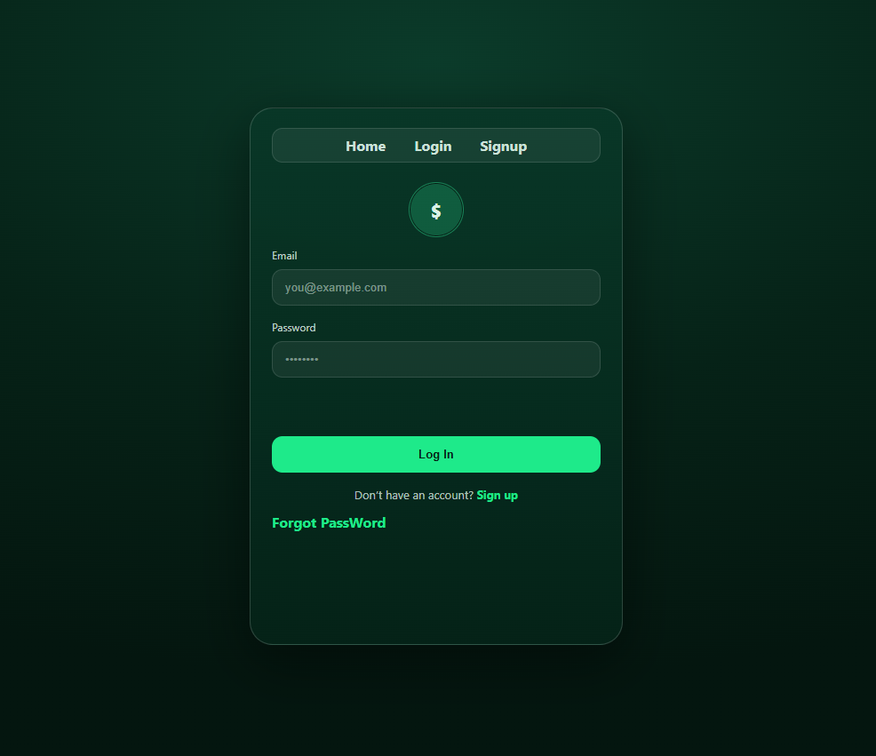
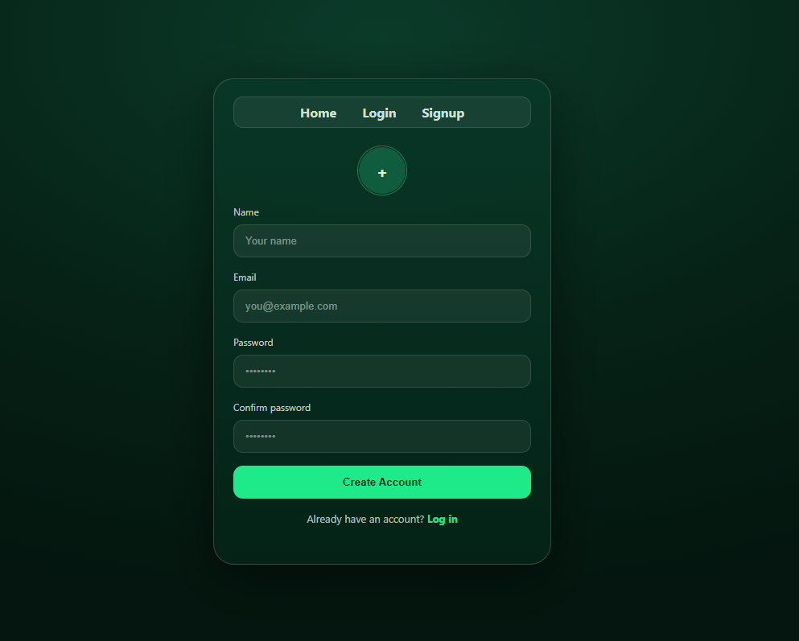
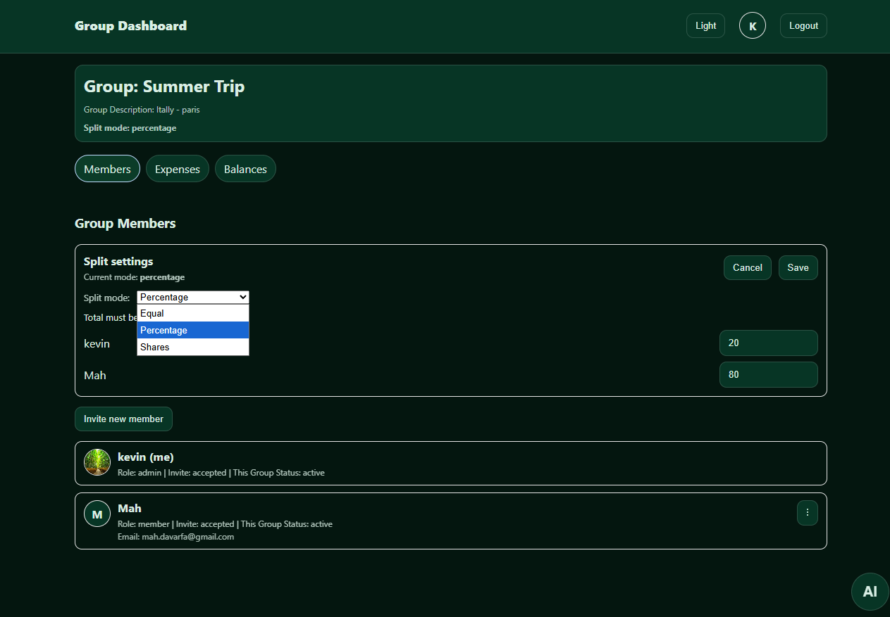
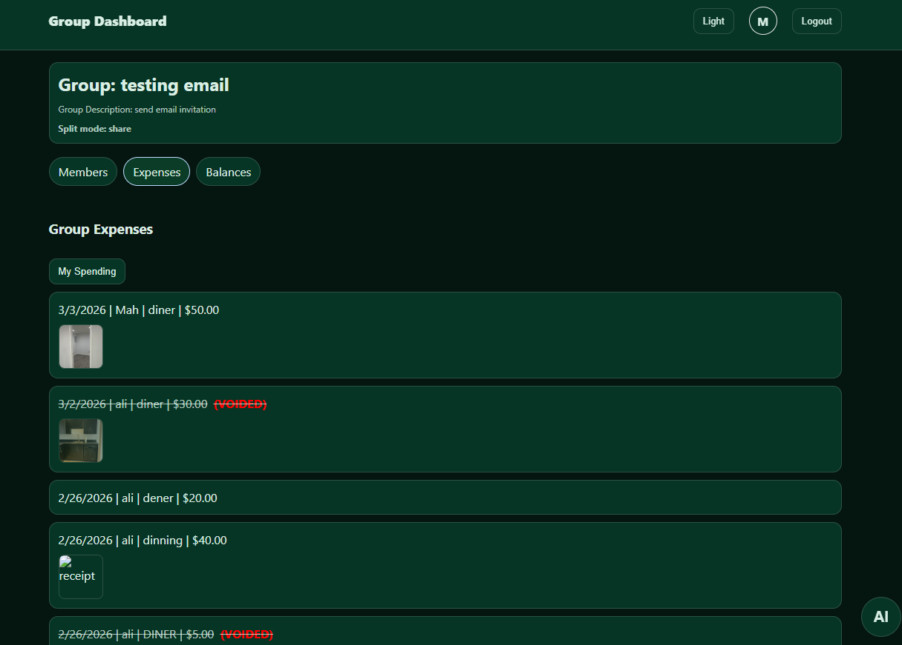
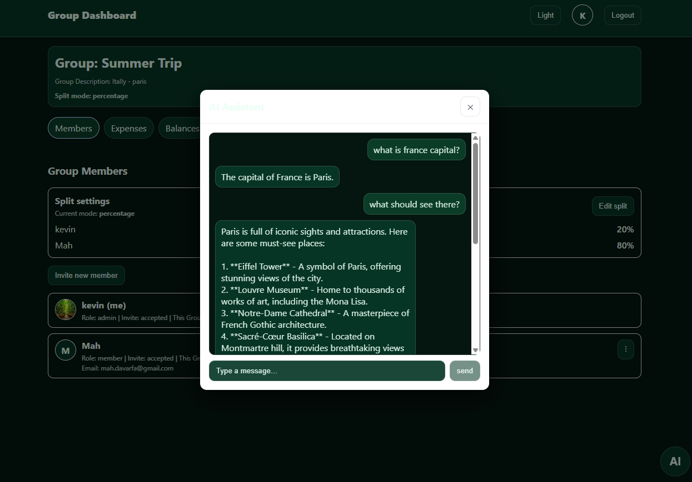
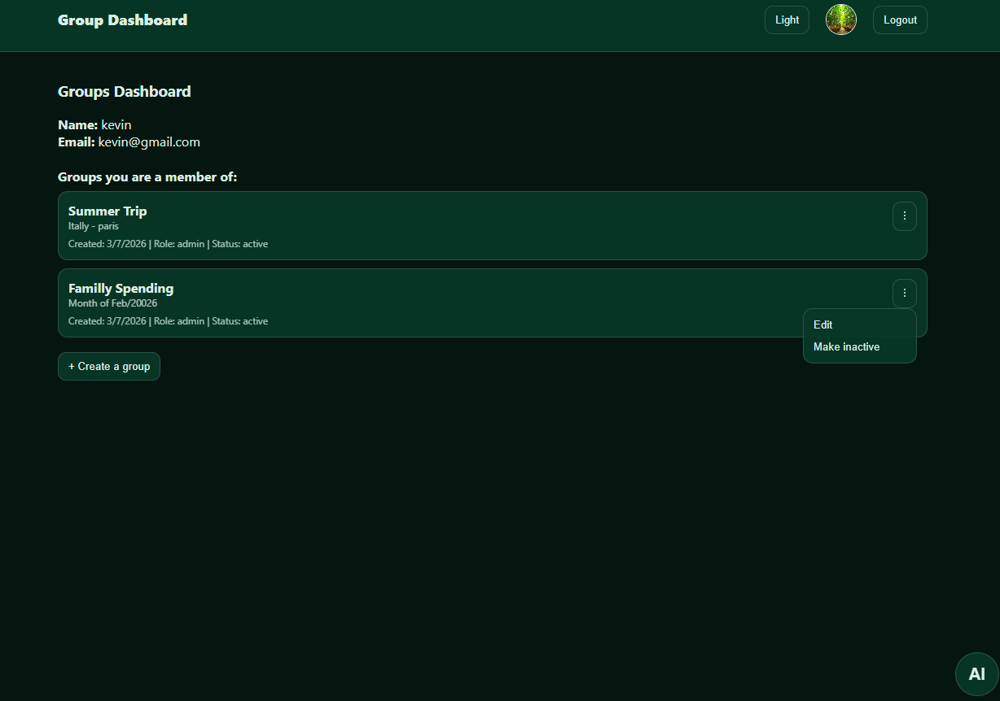
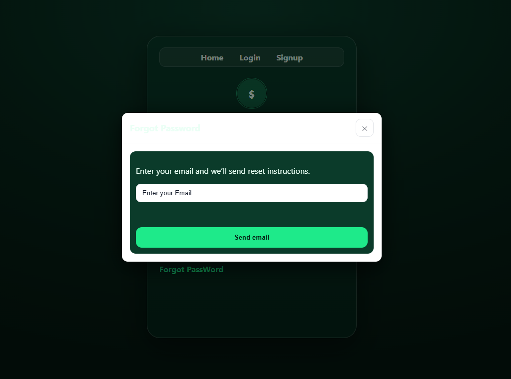
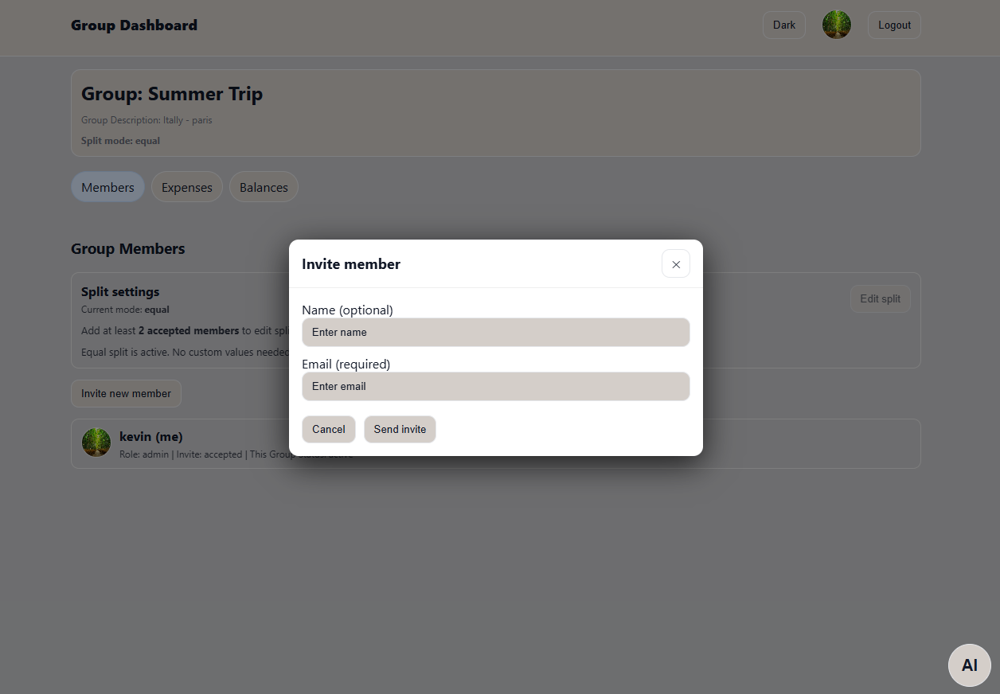

## Split Expense AI

A full-stack expense sharing web application that allows groups of users to track shared expenses, calculate balances, upload receipts, and manage group finances collaboratively.
The application also includes an AI assistant that helps users understand spending patterns and group balances.
This project was built as a Full-Stack JavaScript capstone project.
Current version: Web Application
Future version planned: Mobile Application using Capacitor

# Live: https://splitexpenseai.online/

# Demo Video: https://youtu.be/vi3reMgcl48

# Screenshots

## Features
# Authentication
User signup
User login
JWT authentication
Persistent login sessions
Protected routes

# Group Management
Users can create and manage expense groups.

Features include:
Create groups
Invite members via invite links
Accept invitation tokens
Remove group members
Configure member shares

# Expense Tracking
Users can track group expenses.

Features include:
Add expenses
Edit expenses
Delete expenses
Upload receipt images
View expense history

# Balance Calculation
The application automatically calculates: Equal | Persentage |Share 

Individual shares
Who owes whom
Group balances

# Profile Management
Users can manage their profile:

Update profile information
Upload profile picture
Change password

# AI Assistant
An integrated AI assistant helps users:

Understand group expenses
Analyze spending
Ask financial questions about group activity
or any Asistant

# UI Features
Dark / Light theme toggle
Loading indicators
Error handling
Responsive layout

##  Tech Stack

# Frontend
React
React Router
Vite
JavaScript
CSS

# Backend
Node.js
Express.js

# Database
MongoDB Atlas

# Authentication
JSON Web Tokens (JWT)
bcrypt password hashing

# File Upload 
Multer
Cloudinary

# Email Service
Resend API
Used for:
invitation emails
password reset emails

# AI Integration
OpenAI API

# Security
Helmet
CORS
Rate limiting
Secure environment variables

##  Application Architecture
The project follows a client–server architecture.
# Frontend
The React application:
Handles UI rendering
Manages routing
Communicates with the backend API

# Backend
The Express server:
Provides REST API endpoints
Handles authentication
Processes business logic
Interacts with the database

# Database
MongoDB Atlas stores:
users
groups
expenses
chat sessions

# External Services
Cloudinary
Image storage for:
profile pictures
expense receipts

# Resend
Handles email delivery.

# OpenAI
Provides AI assistant functionality.

## Deployment
The application is deployed using a cloud-based production architecture.

### Domain
A custom domain was purchased and configured using **Namecheap**
https://splitexpenseai.online

The domain is used to provide a clean production URL for the application.

Subdomains were created to separate application services:
Frontend: https://splitexpenseai.online

Backend API: https://api.splitexpenseai.online

Email Sender: mail.splitexpenseai.online
### Frontend Hosting

The React frontend is deployed on **Render Static Sites**.

Render automatically builds the application using:
npm install
npm run build

and publishes the compiled **dist** folder.

Auto-deploy is enabled, so every push to the `main` branch triggers a new deployment.

---

### Backend Hosting

The backend API is deployed on **Render Web Services**.

The Express server provides all REST API endpoints including:

- authentication
- group management
- expenses
- balances
- invitations
- password reset
- AI assistant

The backend is accessible at:
https://api.splitexpenseai.online

---

### Database

The application uses **MongoDB Atlas** as a cloud database.

MongoDB stores:

- users
- groups
- group members
- expenses
- chat sessions

Atlas allows the Render backend to securely connect to the database.

---

### Email Delivery

The application sends transactional emails using **Resend**.

Emails are used for:

- group invitations
- password reset links

To enable production email sending, a subdomain was created:

Resend required several DNS records to verify the domain.

These were added in **Namecheap Advanced DNS**:

**DKIM**
TXT
resend._domainkey.mail

Allows Resend to cryptographically sign outgoing emails.

**SPF**
TXT
send.mail
v=spf1 include:amazonses.com ~all

Authorizes Resend / Amazon SES to send emails from the domain.

**MX**
MX
send.mail → feedback-smtp.us-east-1.amazonses.com

Used by the email service infrastructure.

After verification, the backend email sender was configured as:

Used by the email service infrastructure.

After verification, the backend email sender was configured as:
Split Expense noreply@mail.splitexpenseai.online

This allows the application to send trusted emails to users.

---

### Production Environment

Environment variables are used to securely configure the application in production.

Example backend variables:
MONGODB_URI
JWT_SECRET
RESEND_API_KEY
OPENAI_API_KEY
EMAIL_FROM
FRONTEND_ORIGIN
APP_PUBLIC_URL

The frontend communicates with the backend using:
VITE_API_URL=https://api.splitexpenseai.online

---

### Production Result

The final deployed architecture:

Frontend
https://splitexpenseai.online

Backend API
https://api.splitexpenseai.online

Database
MongoDB Atlas
Email Delivery

Resend

This setup reflects a real-world production deployment used by modern SaaS applications.

## Database Models
The application uses Mongoose models.
# User
name
email
password
profilePicture
createdAt
# Group
name
createdBy
members
createdAt
# GroupMember
userId
groupId
role
share
# Expense
groupId
createdBy
amount
description
receiptUrl
createdAt

# ChatSession
userId
messages
createdAt

## Project Structure

|── split-expense
│
│   ├── client
│   │
│   │   ├── public
│   │
│   │   ├── src
│   │   │
│   │   │── api
│   │   │   ├── ai.api.js
│   │   │   ├── auth.api.js
│   │   │   ├── balances.api.js
│   │   │   ├── expenses.api.js
│   │   │   ├── groups.api.js
│   │   │   ├── http.js
│   │   │   ├── invites.api.js
│   │   │   ├── members.api.js
│   │   │   └── user.api.js
│   │
│   │   │── auth
│   │   │   ├── AuthProvider.jsx
│   │   │   └── ProtectedRoute.jsx
│   │
│   │   │── components
│   │   │   ├── AIAssistant.jsx
│   │   │   ├── ErrorBanner.jsx
│   │   │   ├── KebabMenu.jsx
│   │   │   ├── LoadingSpinner.jsx
│   │   │   ├── Modal.jsx
│   │   │   └── SimpleAvatar.jsx
│   │
│   │   │── layouts
│   │   │   ├── AppLayout.jsx
│   │   │   └── PublicLayout.jsx
│   │
│   │   │── pages
│   │   │   ├── GroupBalancesTab.jsx
│   │   │   ├── GroupExpensesTab.jsx
│   │   │   ├── GroupMembersTab.jsx
│   │   │   ├── GroupPage.jsx
│   │   │   ├── GroupsDashboardPage.jsx
│   │   │   ├── InviteAcceptPage.jsx
│   │   │   ├── LandingPage.jsx
│   │   │   ├── LoginPage.jsx
│   │   │   ├── ProfilePage.jsx
│   │   │   ├── ResetPassword.jsx
│   │   │   └── SignupPage.jsx
│   │
│   │   │── App.jsx
│   │   │── App.css
│   │   │── index.css
│   │   │── main.jsx
│   │
│   │   ├── .env
│   │   ├── index.html
│   │   ├── vite.config.js
│   │   ├── package.json
│   │   └── package-lock.json
│
│   ├── server
│   │
│   │   ├── config
│   │   │   ├── cloudinary.js
│   │   │   ├── database.js
│   │   │   ├── emailService.js
│   │   │   └── emailServiceResetPassword.js
│   │
│   │   ├── controllers
│   │   │   ├── aiController.js
│   │   │   ├── authController.js
│   │   │   ├── expensesController.js
│   │   │   ├── forgotPasswordController.js
│   │   │   ├── groupBalanceController.js
│   │   │   ├── groupMembersController.js
│   │   │   ├── groupsController.js
│   │   │   ├── invitesController.js
│   │   │   ├── resettingPasswordController.js
│   │   │   ├── signupController.js
│   │   │   └── userSettingsController.js
│   │
│   │   ├── middlewares
│   │   │   ├── auth.js
│   │   │   ├── errorHandler.js
│   │   │   ├── groupAuth.js
│   │   │   ├── uploadProfilePicture.js
│   │   │   └── uploadReceipt.js
│   │
│   │   ├── models
│   │   │   ├── ChatSession.js
│   │   │   ├── Expense.js
│   │   │   ├── Group.js
│   │   │   ├── GroupMember.js
│   │   │   └── User.js
│   │
│   │   ├── routes
│   │   │   ├── ai.routes.js
│   │   │   ├── balances.routes.js
│   │   │   ├── expenses.routes.js
│   │   │   ├── groupMembers.routes.js
│   │   │   ├── groups.routes.js
│   │   │   ├── invites.routes.js
│   │   │   └── user.routes.js
│   │
│   │   ├── services
│   │   │   └── aiService.js
│   │
│   │   ├── uploads
│   │   │   └── receipts
│   │
│   │   ├── utils
│   │   │   └── generateToken.js
│   │
│   │   ├── app.js
│   │   ├── server.js
│   │   ├── .env
│   │   ├── .env.example
│   │   ├── package.json
│   │   └── package-lock.json
│
├── wireframes
│
├── .gitignore
└── README.md

## Environment Variables
# Server .env
PORT=
MONGODB_URI=
SALT_ROUNDS=10
JWT_SECRET=
NODE_ENV=development

FRONTEND_ORIGIN=

OPENAI_API_KEY=
RESEND_API_KEY=

APP_PUBLIC_URL=
EMAIL_FROM=

CLOUDINARY_CLOUD_NAME=
CLOUDINARY_API_KEY=
CLOUDINARY_API_SECRET=
CLOUDINARY_URL=

# Client .env
VITE_API_URL=http://localhost:3011

## Installation
# Clone the Repository
https://github.com/mah-davarfa/split-expense.git

##  Backend Setup
cd split-expense/server
npm install
npm run dev

## Frontend Setup
cd split-expense/client
npm install
npm run dev

###### Future Improvements
Planned improvements include:
Mobile application using Capacitor
Real-time updates
Expense analytics
Notifications
Smart AI budgeting insights

## Author
Mahmoud Davarfara

Full-Stack JavaScript Developer

GitHub
https://github.com/mah-davarfa

Portfolio
https://mah-davarfa.github.io/portfolio-projects/

